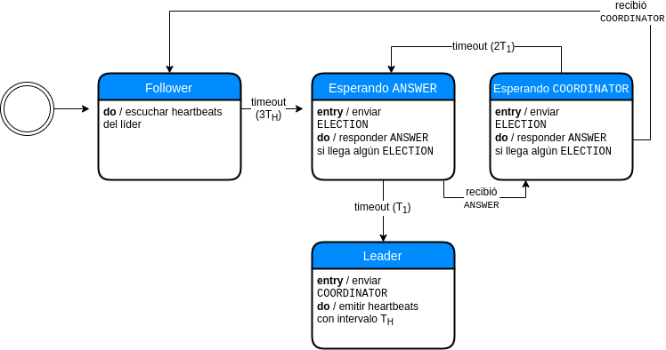

\ \ \ \ \ \ \ \ \ \ \ \ \ \ \ \ \ \ \ \ \ \ \ \ \ \ \ \ \ \ \ \ \ \ \ \   \

\ \ \

\ \ \

\ \ \

\ \ \

\ \ \

\ \ \

\ \ \

\ \ \

\ \ \

\ \ \

\ \ \

\ \ \

\ \ \

\ \ \

\ \ \

\ \ \

\ \ \

\ \ \

**Alumnos**: Kevin Cajachuán (98725), Joaquín Seguí, Joaquín Torré Zaffaroni(98314)

**Materia**: Sistemas Distribuidos I, 75.74

**Cuatrimestre**: 2C2019

**Profesores**: Pablo D. Roca, Ezequiel Torres Feyuk

\newpage

## Introducción

Para el presente trabajo práctico se propone extender la funcionalidad del
trabajo práctico 2 incorporando nociones de tolerancia a fallos y manejo de
múltiples clientes. El resultado es, entonces, una arquitectura
distribuída orientada a _streaming_ utilizando _message oriented middlewares_
que soporta caídas de los procesos sin que ello afecte al resultado del cómputo.

El diseño de la arquitectura está orientado a un _pipeline_ con
unidades de cálculo ligadas al negocio, más otros procesos de soporte. En este
informe detallamos las decisiones detrás del diseño, documentamos la implementación
y marcamos puntos de mejora.

## Vista lógica

El DAG de este trabajo práctico es casi el mismo que el DAG del trabajo práctico 2
con la diferencia de que se agrega la etapa de filtrado del intervalo de fechas
en el que el cliente quiere que se haga el análisis. Por esta razón el cliente
le envía las líneas de los archivos al nuevo filtro y a partir de ahí, con las
líneas filtradas, se divide el procesamiento en 3 ramas:

1. Cálculo de porcentaje de victorias de zurdos sobre diestros y viceversa.
2. Partidos en los que el ganador tenía al menos 20 años más que el perdedor.
3. Cálculo del promedio de la duración en minutos de los partidos en cada superficie.

## Vista de desarrollo

Diagrama de paquetes

## Vista de proceso

### Esquema de multiprocesamiento

Comentar cómo se hizo

### Tolerancia a fallos

Para tolerancia a fallos utilizamos un proceso llamado __Watchdog__ que recibe
los _heartbeats_ de los demás procesos, y al detectar que uno se cayó los levanta
con la siguiente lógica:

\ \ \ \ \ \ \ \ \ \ \ \ \ \ \ \ \ \ \ \ \ \ \ \ \ \ \  \

El __Watchdog__ tiene un hilo donde periódicamente revisa el estado de los nodos,
es decir, el tiempo desde el último _heartbeat_. Si alguno pasa el límite se
lo considera caído. Para evitar que se lo levante múltiples veces utilizamos un
_flag_ llamado `respawning`, que bloquea el inicio de otro hilo que lo levante.
Un hilo levantado en el momento ejecuta `docker stop` por si el contenedor seguía
vivo aunque sin responder, luego `docker start` y se le da un margen de tiempo ($T_2$)
para esperar a que se levante y empiece a dar _heartbeats_, luego se saca el _flag_ de
`respawning`. Obsérvese que no estamos revisando que realmente se levantó el
contenedor, esto es porque no es necesario. Si no se levantó o se cayó al
levantarse, en otro ciclo del _health checker_ se lanzará otro hilo para levantarlo
nuevamente.

Sin embargo, el __Watchdog__ también puede fallar. Debido a eso, tenemos varias
instancias del nodo corriendo, solo uno en modo líder y el resto en modo _follower_.
Sólo el líder es el que escucha los _heartbeats_ y levanta los nodos.
Además, el líder manda sus propios _heartbeats_ al resto de los _followers_, de manera
de que éstos también puedan saber si se muere. En ese caso, se elige
un nuevo líder a través del algoritmo Bully.

Al algoritmo Bully detallado en Coulouris (2005) le hicimos ciertas modificaciones
y extensiones. Como mencionamos antes, como mecanismo de detección de caída del líder
utilizamos una _exchange_ de tipo _fanout_ donde cada proceso
puede consumir los _heartbeats_ del líder. Un detalle que no se menciona en
el libro es el tamaño del _timeout_ de esperar un mensaje del tipo `COORDINATOR`.
Para relacionarlo a la longitud del timeout del mensaje `ANSWER`($T_1$) podemos
pensar en el siguiente esquema. Si tenemos tres procesos, $p_1$, $p_2$ y $p_3$,
$p_1$ le enviará `ELECTION` a $p_2$ y $p_3$. Supongamos además que $p_3$ está
caído. $p_2$ responde `ANSWER` a $p_2$ y envía `ELECTION` a $p_3$, esperando
hasta $p_2$ hasta el _timeout_ y $p_1$ hasta otro también. Al transcurrir $T_1$
se da cuenta $p_2$ que $p_3$ no está activo, entonces debe pasar a ser el líder.
Como $T_1 = 2*T_{transmision} + T_{procesamiento}$, llegamos a que el _timeout_
del mensaje `COORDINATOR` tiene como cota mínima $2T_1$. Si es menor, hay riesgo
de que $p_1$ quiera comenzar otra elección antes de terminar la actual.

En la implementación era necesario especificar qué comportamiento tenía el
sistema al incorporarse un nodo nuevo (re-incorporarse, en realidad). Una
opción parece ser iniciar una elección y consensuar un nuevo líder. El algoritmo
Bully, sin embargo, no se presta a este esquema. Esto es porque solo envía
mensajes `ELECTION` a los procesos con identificadores superiores. Los procesos
con identificadores inferiores no se darán cuenta de que ha comenzado una elección.
Si además el proceso levantado tiene identificador máximo, ejecutará la
elección solo y se definirá como líder. Si bien es posible que los otros acepten
al nuevo líder al recibir su mensaje `COORDINATOR`, también implica que por breves
momentos hay dos líderes y eso no es aceptable. La solución, no aclarada
en Coulouris (2005), es que todos los procesos inicien siguiendo al líder,
escuchando sus _heartbeats_.

\ \ \ \ \ \ \ \ \ \ \ \ \ \ \ \ \ \ \ \ \ \ \ \ \ \ \ \   \

Una observación adicional. Los _followers_ no reciben información adicional
del líder ni procesan los _heartbeats_. Sólo al hacer la transición a líder
empiezan a hacerlo. Exceptuando el inicio del _cluster_, siempre que
asume un nuevo líder es necesario levantar algún nodo (como mínimo, el
nodo que era líder anterior y se cayó). Por este estado parcial del sistema
es fundamental que haya un archivo de configuración inicial con la cual el
__Watchdog__ pueda saber cuántos nodos tiene que haber de cada tipo de
proceso.

### Persistencia

Anteriormente desarrollamos la idea un almacenamiento con un maestro y varios
esclavos. Asimismo, los nodos que integran el _storage_ se abstraen de decidir
quién será el maestro. Establecido eso, ahora describiremos cómo se replica la
información en el sistema. El comportamiento se basa en las colas durables
de RabbitMQ: una vez que el maestro recibe una escritura, la replica
en un _exchange_ de tipo _fanout_. No es necesario esperar a un `ACK` de las
réplicas, porque Rabbit nos está garantizando la entrega. Aunque un nodo
esté caido, al levantarse seguirá consumiendo de la cola y no es necesario
diseñar un protocolo de "_catch-up_" adicional. Las escrituras en desorden
no son problema porque los datos se sobre-escriben sólo si el _timestamp_
del mensaje (puesto por el productor) es superior. Dado que los datos están
particionados por _job_ y por identificador del nodo, no tenemos productores
que concurrentemente escriben un mismo dato; además, si asumimos que no
se desincroniza el reloj del productor (restricción suave), este esquema no falla.

Finalmente, el esquema de replicación de información es sencillo.

Como el _master_ puede caerse, es necesario que otro nodo asuma el rol.
Para evitar tener que implementar de nuevo un algoritmo de elección
de líder, utilizamos el proceso __Watchdog__. En efecto, cada nodo
de almacenamiento agrega metadata a su _heartbeat_ con la información
del rol que cumple. Esta información es almacenada por el __Watchdog__
y esto le permite saber cuándo se cae el nodo maestro.

Entonces es necesario analizar el esquema de replicación teniendo en
cuenta las fallas de los nodos. En el caso de un esclavo que
se muere y luego se levanta, simplemente puede seguir leyendo
de su cola de Rabbit que es durable. Puede pasar que haya persistido
un dato y se haya caído antes de dar el `ACK`, pero como las
escrituras son _overwrites_ con _timestamps_ no es problema. Desde
el punto de vista del nodo maestro, si se cae antes de dar el `ACK`
el nuevo maestro puede recibir la misma escritura. Por la misma
razón que antes, esto no es problema.

A continuación se puede ver el diagrama que ilustra la
generación de un nuevo nodo maestro.

## Vista física

Diagrama de despliegue

## Escenarios

Comentar los casos de prueba que tenemos en el doc de aceptación

## Conclusiones

Puntos de mejora

## Referencias

Coulouris, G. F., Dollimore, J., & Kindberg, T. (2005). Distributed systems: concepts and design. pearson education.

Apuntes de clase.
