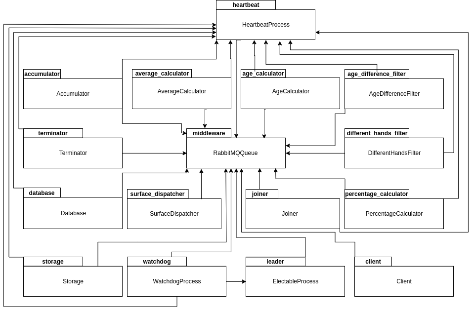
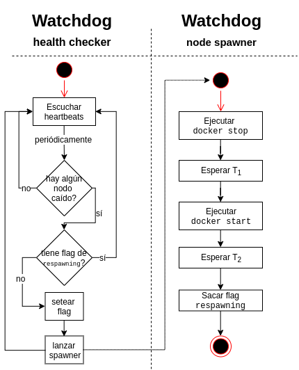
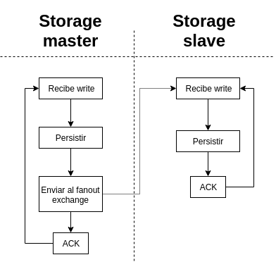
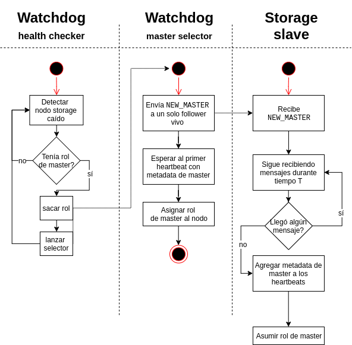
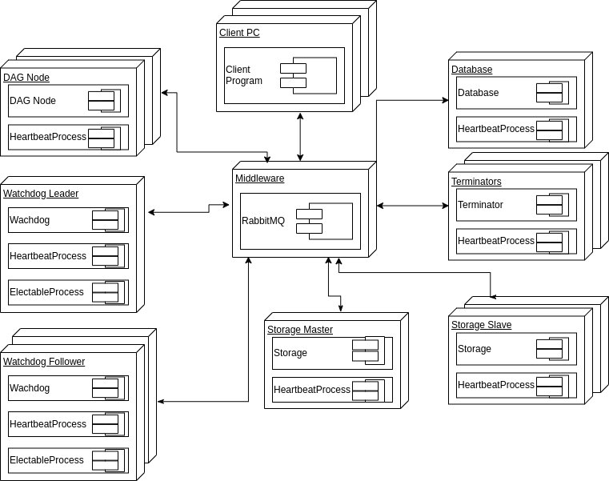

\ \ \ \ \ \ \ \ \ \ \ \ \ \ \ \ \ \ \ \ \ \ \ \ \ \ \ \ \ \ \ \ \ \ \ \   \

\ \ \

\ \ \

\ \ \

\ \ \

\ \ \

\ \ \

\ \ \

\ \ \

\ \ \

\ \ \

\ \ \

\ \ \

\ \ \

\ \ \

\ \ \

\ \ \

\ \ \

\ \ \

**Alumnos**: Kevin Cajachuán (98725), Joaquín Seguí (91451), Joaquín Torré Zaffaroni(98314)

**Materia**: Sistemas Distribuidos I, 75.74

**Cuatrimestre**: 2C2019

**Profesores**: Pablo D. Roca, Ezequiel Torres Feyuk

\newpage

## Introducción

Para el presente trabajo práctico se propone extender la funcionalidad del
trabajo práctico 2 incorporando nociones de tolerancia a fallos y manejo de
múltiples clientes. El resultado es, entonces, una arquitectura
distribuída orientada a _streaming_ utilizando _message oriented middlewares_
que soporta caídas de los procesos sin que ello afecte al resultado del cómputo.

El diseño de la arquitectura está orientado a un _pipeline_ con
unidades de cálculo ligadas al negocio, más otros procesos de soporte. En este
informe detallamos las decisiones detrás del diseño, documentamos la implementación
y marcamos puntos de mejora.

## Arquitectura general

La arquitectura general del sistema se divide en tres partes principales:

1. *DAG* en el que se encuentra toda la lógica del procesamiento en _pipeline_
de los datos para obtener la respuesta. Los nodos de dicho _pipeline_ pueden ser
_stateful_ o _stateless_. En el caso ideal sin fallas, únicamente sería necesario
esta componente en la arquitectura dado que la lógica no cambia. En la sección de
vista lógica se explica con más detalle la división del procesamiento.
2. *Storage* en el que se guardan los diferentes estados de los nodos que sean
_stateful_, es decir, que poseen estado y deben recuperarlo al momento de una caída.
El storage se compone de un proceso _master_ y varios _slaves_ para replicar los datos
que se persisten. En caso de la caída del _master_, el *Watchdog* elige uno nuevo entre
los _slaves_.
3. *Watchdog* que es la parte de la arquitectura que provee tolerancia a fallos
(junto con el storage) y cuyo propósito es detectar cuándo un nodo se cae y debe
levantar uno nuevo para poder seguir con el procesamiento. En esta parte hay un proceso
líder y varios followers, siendo el líder el que se encarga de la detección. En caso
de que el líder muera, se utiliza un algoritmo de elección de líder para elegir uno nuevo.

Esto se puede ver diagramado en la Figura 1.

En el diagrama de robustez (Figura 2) se puede observar que los procesos involucrados en la lógica del
procesamiento de los datos tiene una relación directa con el DAG mostrado en la vista lógica.
Además cada uno de los procesos tiene comunicación con el proceso _watchdog_ para que éste pueda detectar
las caídas de los procesos.
En el caso de los procesos que pertenecen a nodos _stateful_, también tienen comunicación con los procesos de _storage_,
específicamente con el _master_ y este con los _slaves_.

### Hipótesis y Restricciones

Se tomaron las siguientes hipótesis durante el diseño:

 - Siempre que el *Watchdog* quiere matar a una instancia, puede matarla.
 - No existen particiones en la red.
 - Los *ID* son generados por cada cliente. No existen dos *ID* iguales.
 - Eventualmente una instancia de un filtro se puede levantar y/o las colas tienen tamaño infinito de buffer.
 - Todo nodo de *Storage* puede ser iniciado. No hay fallas de hardware de discos en ningún nodo de *Storage*.

## Escenarios

### Casos de Uso

El caso de uso del sistema es uno sólo. Consiste únicamente en solicitar un
reporte de información. El usuario lanzará una instrucción a la aplicación para
que pueda procesar la información sobre los partidos de tenis y generar el
reporte con la estadística requerida por los objetivos mencionados anteriormente.
Dicha instrucción podrá o no indicar un período de tiempo consecutivo haciendo
que el análisis de la información sea únicamente dentro de ese período establecido
por el cliente. En caso de no hacerlo en forma explícita, se analizarán toda la
información, independientemente del período dentro del cuál se encuentre.
De esta forma, el diagrama de casos de uso del sistema se puede ver en la Figura 3.

### Criterios de aceptación

Dado el único caso de uso, podemos armar los siguientes criterios de aceptación
que integran los requerimientos no funcionales.

 - Camino feliz
    - Levantar el sistema con docker compose
    - Demostrar que un job lanzado se ejecuta y se obtiene el resultado esperado
 - Camino feliz con multiple jobs
    - Al menos dos jobs corriendo en paralelo
    - Las respuestas a cada job dan el resultado esperado
    - El sistema sigue prendido
 - Prueba de carga
    - Un job sólo utilizando un archivo de > 200 Mb
    - Se debería ver si hay un cuello de botella revisando CPU consumido por los containers, colas de rabbit.
 - Mejorar el caso anterior escalando la variable detectada como cuello de botella
    - Con el sistema idle, se tira el Watchdog y se cambia el líder
    - Es necesario saber quién es el líder, que se murió el líder, etc
    - Es necesario mostrar la secuencia de mensajes entre los participantes para ver coherencia en leader election
 - Dejamos corriendo la prueba de >200 Mb
    - Se tira un líder, se degrada el sistema
    - Se incorpora el sistema y sigue procesando
    - Se obtiene el mismo resultado
 - Se mata uno de los followers
    - Necesitamos ver que al levantarse, se pueda hacer catch up

## Vista lógica

El DAG de este trabajo práctico es similar al DAG del trabajo práctico 2
con la diferencia de que se agrega la etapa de filtrado del intervalo de fechas
en el que el cliente quiere que se haga el análisis. Por esta razón el cliente
le envía las líneas de los archivos al nuevo filtro y a partir de ahí, con las
líneas filtradas, se divide el procesamiento en 3 ramas:

1. Cálculo de porcentaje de victorias de zurdos sobre diestros y viceversa.
2. Partidos en los que el ganador tenía al menos 20 años más que el perdedor.
3. Cálculo del promedio de la duración en minutos de los partidos en cada superficie.

Esto se puede ver representado en la Figura 4.

## Vista de desarrollo

En el diagrama de paquetes (Figura 5) podemos ver cómo está organizado el sistema.
Fundamentalmente, todos los paquetes se conectan con el _middleware_.  Vemos
que los paquetes incluyen los distintos tipos de nodos de lógica de
negocio (`accumulator`, `age_calculator`, `average_calculator`,
`percentage_calculator`, `different_hands_filter`, `surface_dispatcher`,
`age_calculator`, `age_difference_filter` y `joiner`). También están
los paquetes que dan soporte a la aplicación:

* `heartbeat` es una clase que le agrega a un _entry point_ la funcionalidad
de _heartbeat_.
* `leader` es una clase que ejecuta cierta lógica sólo cuando un proceso
es elegido líder.
* `watchdog` es el nodo que escucha los _heartbeats_ y levanta los procesos
que no han emitido uno en un tiempo dado.
* `storage` es el nodo que puede funcionar como maestro o esclavo y permite
la persistencia de los datos ante fallas del sistema.

Además,
todos los nodos incluyen al _heartbeat_, excepto el cliente. La lógica es la siguiente:
el punto de entrada de cada proceso es el _heartbeat process_ y a éste se le
pasa la información del _entry point_ de la lógica del negocio. Un esquema similar
sucede con el algoritmo Bully, que está en el paquete _leader_. De esta manera
se pueden encadenar los comportamientos, tal que _heartbeat process_ dispare
la lógica de _electable process_ y que éste finalmente dispare la lógica de
_watchdog_.

## Vista de proceso

### Esquema de multiprocesamiento

Para poder implementar un esquema de multiprocesamiento se optó por identificar
a cada cliente que ejecuta una consulta con un *ID* único. Este *ID* es un *UUID*
generado por el programa cliente que representa una consulta de un cliente en particular,
y el mismo se va propagando por todo el pipeline de ejecución.
Por cada línea procesada para cada ejecución, se concatena este *ID* del cliente
a la información a calcular (junto con el intervalo de fechas). De esta forma,
la información sigue su camino sin mezclarse entre consultas.
Una vez lanzada la consulta, cada cliente queda esperando la respuesta en una cola
cuyo nombre contiene ese *ID* único. En la Figura 6 se puede ver este esquema.

### Tolerancia a fallos

Para tolerancia a fallos utilizamos un proceso llamado __Watchdog__ que recibe
los _heartbeats_ de los demás procesos, y al detectar que uno se cayó los levanta
con la lógica ilustrada en la Figura 7.

El __Watchdog__ tiene un hilo donde periódicamente revisa el estado de los nodos,
es decir, el tiempo desde el último _heartbeat_. Si alguno pasa el límite se
lo considera caído. Para evitar que se lo levante múltiples veces utilizamos un
_flag_ llamado `respawning`, que bloquea el inicio de otro hilo que lo levante.
Un hilo levantado en el momento ejecuta `docker stop` por si el contenedor seguía
vivo aunque sin responder, luego `docker start` y se le da un margen de tiempo ($T_2$)
para esperar a que se levante y empiece a dar _heartbeats_, luego se saca el _flag_ de
`respawning`. Obsérvese que no estamos revisando que realmente se levantó el
contenedor, esto es porque no es necesario. Si no se levantó o se cayó al
levantarse, en otro ciclo del _health checker_ se lanzará otro hilo para levantarlo
nuevamente.

Sin embargo, el __Watchdog__ también puede fallar. Debido a eso, tenemos varias
instancias del nodo corriendo, solo uno en modo líder y el resto en modo _follower_.
Sólo el líder es el que escucha los _heartbeats_ y levanta los nodos.
Además, el líder manda sus propios _heartbeats_ al resto de los _followers_, de manera
de que éstos también puedan saber si se muere. En ese caso, se elige
un nuevo líder a través del algoritmo Bully.

### Elección de líder

El algoritmo Bully detallado en Coulouris (2005) fue modificado y extendido.
Como fuera mencionado antes, como mecanismo de detección de caída del líder
utilizamos una _exchange_ de tipo _fanout_ donde cada proceso
puede consumir los _heartbeats_ del líder. Un detalle que no se menciona en
el libro es el tamaño del _timeout_ de esperar un mensaje del tipo `COORDINATOR`.
Para relacionarlo a la longitud del timeout del mensaje `ANSWER`($T_1$) podemos
pensar en el siguiente esquema. Si tenemos tres procesos, $p_1$, $p_2$ y $p_3$,
$p_1$ le enviará `ELECTION` a $p_2$ y $p_3$. Supongamos además que $p_3$ está
caído. $p_2$ responde `ANSWER` a $p_1$ y envía `ELECTION` a $p_3$, esperando
$p_2$ hasta el _timeout_ y $p_1$ hasta otro también. Al transcurrir $T_1$
se da cuenta $p_2$ que $p_3$ no está activo, entonces debe pasar a ser el líder.
Como $T_1 = 2*T_{transmision} + T_{procesamiento}$, llegamos a que el _timeout_
del mensaje `COORDINATOR` tiene como cota mínima $2T_1$. Es decir, $p_2$ tarda
$T_1$ en darse cuenta que debe ser líder y en procesar y transmitir esa información
puede tardar nuevamente hasta $T_1$. Si es menor, hay riesgo
de que $p_1$ quiera comenzar otra elección antes de terminar la actual. Observamos
que si hay $N$ nodos esto no afecta al algoritmo, pues $p_1$ le avisó a todos los
superiores que había una elección. No son necesarios varios ``hops'' para comunicar
la información: este esquema se generaliza considerando a $p_2$ como el proceso _vivo_
máximo -- el comportamiento de los otros procesos no es relevante a este problema
en particular.

En la implementación era necesario especificar qué comportamiento tenía el
sistema al incorporarse un nodo nuevo (re-incorporarse, en realidad). Una
opción parece ser iniciar una elección y consensuar un nuevo líder. El algoritmo
Bully, sin embargo, no se presta a este esquema. Esto es porque solo envía
mensajes `ELECTION` a los procesos con identificadores superiores. Los procesos
con identificadores inferiores no se darán cuenta de que ha comenzado una elección.
Si además el proceso levantado tiene identificador máximo, ejecutará la
elección solo y se definirá como líder. Si bien es posible que los otros acepten
al nuevo líder al recibir su mensaje `COORDINATOR`, también implica que por breves
momentos hay dos líderes y eso no es aceptable. Por esto, la solución que implementamos
nosotros aprovecha el uso de la cola particular donde el líder publica sus
_heartbeats_. Un proceso al levantarse consume de esta cola, y sólo comienza
una nueva elección cuando detecte un _timeout_. Esto implica que si ya había un
líder entonces no comience una nueva elección mientras viva y que si no había uno
(por inicio del sistema, por ejemplo) se comience una nueva elección. El diagrama
de estado se puede ver en la Figura 8.

Una observación adicional. Los _followers_ no reciben información adicional
del líder ni procesan los _heartbeats_. Sólo al hacer la transición a líder
empiezan a hacerlo. Exceptuando el inicio del _cluster_, siempre que
asume un nuevo líder es necesario levantar algún nodo (como mínimo, el
nodo que era líder anterior y se cayó). Por este estado parcial del sistema
es fundamental que haya un archivo de configuración inicial con la cual el
__Watchdog__ pueda saber cuántos nodos tiene que haber de cada tipo de
proceso.

### Persistencia

Anteriormente desarrollamos la idea un almacenamiento con un maestro y varios
esclavos. Asimismo, los nodos que integran el _storage_ se abstraen de decidir
quién será el maestro. Establecido eso, la información en el sistema
se replica de la siguiente manera. El comportamiento se basa en las colas durables
de RabbitMQ: una vez que el maestro recibe una escritura, la replica
en un _exchange_ de tipo _fanout_. No es necesario esperar a un `ACK` de las
réplicas, porque Rabbit nos está garantizando la entrega. Aunque un nodo
esté caido, al levantarse seguirá consumiendo de la cola y no es necesario
diseñar un protocolo de "_catch-up_" adicional. Las escrituras en desorden
no son problema porque los datos se sobre-escriben sólo si el _timestamp_
del mensaje (puesto por el productor) es superior. Dado que los datos están
particionados por _job_ y por identificador del nodo, no tenemos productores
que concurrentemente escriben un mismo dato; además, si asumimos que no
se desincroniza el reloj del productor (restricción suave), este esquema no falla.

Finalmente, el esquema de replicación de información es sencillo (Figura 9).

Como el _master_ puede caerse, es necesario que otro nodo asuma el rol.
Para evitar tener que implementar de nuevo un algoritmo de elección
de líder, utilizamos el proceso __Watchdog__. En efecto, cada nodo
de almacenamiento agrega metadata a su _heartbeat_ con la información
del rol que cumple. Esta información es almacenada por el __Watchdog__
y esto le permite saber cuándo se cae el nodo maestro.

Entonces es necesario analizar el esquema de replicación teniendo en
cuenta las fallas de los nodos. En el caso de un esclavo que
se muere y luego se levanta, simplemente puede seguir leyendo
de su cola de Rabbit que es durable. Puede pasar que haya persistido
un dato y se haya caído antes de dar el `ACK`, pero como las
escrituras son _overwrites_ con _timestamps_ no es problema. Desde
el punto de vista del nodo maestro, si se cae antes de dar el `ACK`
el nuevo maestro puede recibir la misma escritura. Por la misma
razón que antes, esto no es problema.

Se puede ver el diagrama que ilustra la
generación de un nuevo nodo maestro en la Figura 10.

## Vista física

En el diagrama de despliegue (Figura 11) podemos ver un estado correcto del _deployment_
de la aplicación. Marcamos en el diagrama la diferencia entre los roles que se
cumplen en tiempo ejecución, como los nodos _followers_ y _leaders_, o _master_ y
_slaves_. Inicialmente todos los procesos arrancan como _followers_ o _slaves_. Después
de la primera elección un nodo es elegido _leader_ y éste luego puede definir quién
es el _storage master_.

A diferencia del TP2 también vemos que se aceptan múltiples clientes.

## Conclusiones

En el presente trabajo práctico desarrollamos un sistema distribuido de procesamiento
en forma de _pipeline_ con tolerancia a fallos. Utilizamos conceptos de
_message oriented middlewares_, arquitecturas distribuídas, patrones de diseño
y algoritmos de consenso.

## Referencias

Coulouris, G. F., Dollimore, J., & Kindberg, T. (2005). Distributed systems: concepts and design. pearson education.

Apuntes de clase.
